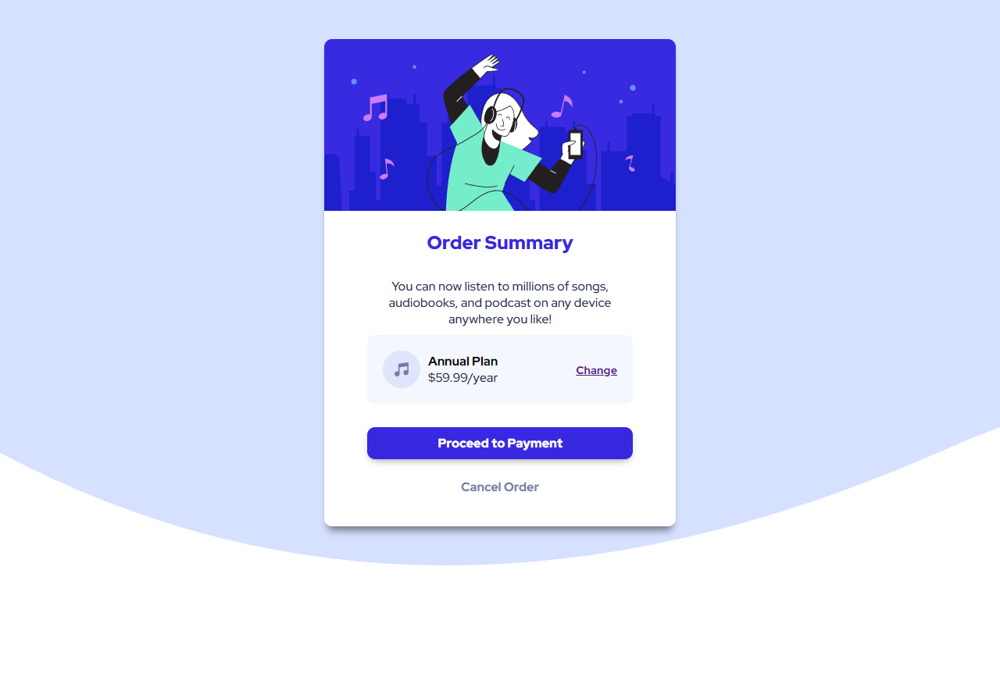

## Overview

This is the most basic newbies things challenge, it is an order summary card that used in music streaming services.

### The challenge

Users should be able to:

- See hover states for interactive elements

### Screenshot

### Links

- Solution URL:
- Live Site URL: [https://fervent-cray-0339b2.netlify.app/]

## My process

Started this project in 11/10/2021 12.20 PM
and finished in 13.40 PM
around 1.5 half hours for newbie project, the main struggle for me is positioning items inside the card.
Not using other than div is also new to me, i think its called Semantic, i spend sometimes reading about it.
I think with figma/sketch file i can do the sizing way so much better.

### Built with

- Semantic HTML5 markup
- CSS custom properties
- Flexbox

### What I learned

I still need to learn about position sizing with HTML and CSS because its really the main thing about webdeveloping.

### Continued development

I will move on to another project.

### Useful resources

## Author

- Frontend Mentor - [@althafdaa]
